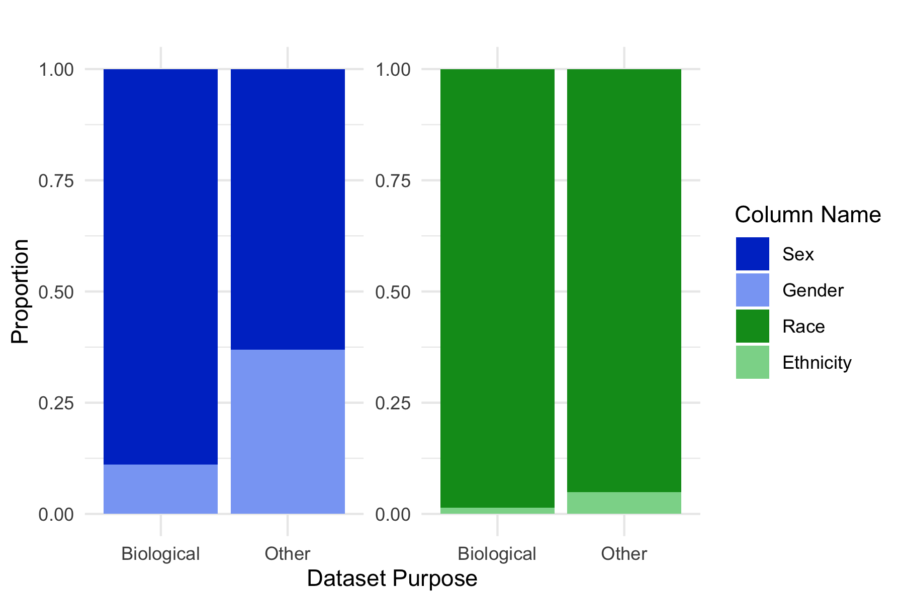
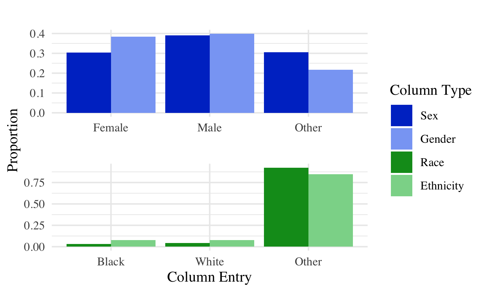

### Social Divisions in Data

*Simon P. Couch*

This is a research compendium for “Social Divisions in Data,” a term
paper for SOC 326 (Science and Social Difference) at Reed College in
Fall 2019.

Rather than viewing datasets as unargumentative, sterile, or “raw,” I
argue that datasets, and operations carried out on them, express the
social conceptualizations held by their creators. Especially in
reference to social categorizations and identities, naming columns;
writing descriptions of these columns in codebooks; constructing
categories within which subjects must identify (or be assigned); binning
entries on a continuous scale into discrete categories; naming these new
categories; constructing and naming new categories within columns from
pre-existing categories; constructing and naming new columns from
pre-existing columns; and assigning numerical (and by extension,
ordinal) values to categories is a process of argumentation,
claims-making, and boundary work. More specifically, in this paper, I
examine how sex, gender, race, and ethnicity are named and encoded as
variables in data, and how this process is patterned by the identities
held by the datasets’ creators.

Namely, I first argue that, when measuring sex/gender and race/ethnicity
effects, biologists are more likely to name their columns sex or race
rather than gender or ethnicity,
respectively.

Then, I attempt to show that the distributions within these columns are,
in fact, nearly identical, regardless of what the column is
named.

Altogether, then, I argue that sex and gender are viewed as
interchangeable terms for the same phenomena, (more exactly, for sex,)
and biologists are more likely to use the term \`\`Sex’’ in order to
suggest a more purely biological mechanism for effects observed in the
data.
