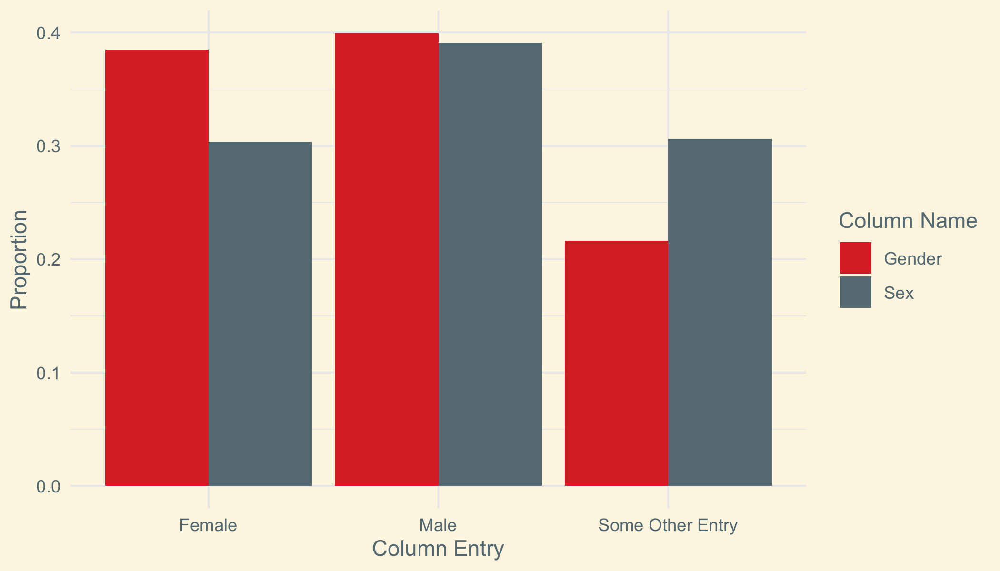
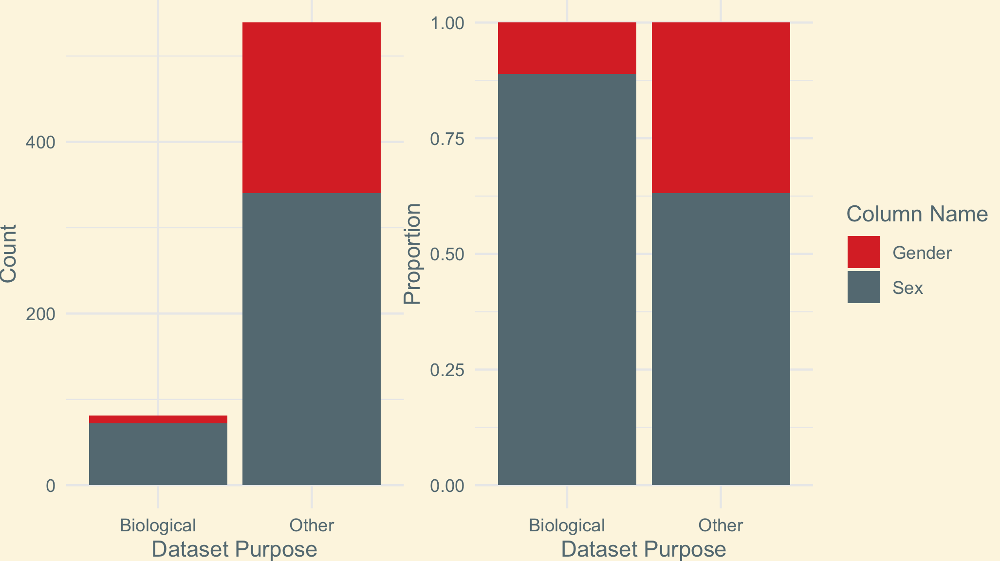

```{r setup, include = FALSE}
knitr::opts_chunk$set(fig.width = 13, 
                      message = FALSE, 
                      warning = FALSE)
```

class: title-slide, center, middle

# Social Categorizations in CRAN Data

*ASA OR Spring Meeting, May 21 2020*

Simon Couch | `r fontawesome::fa('twitter', fill = '#fdf6e3')` `r fontawesome::fa('github', fill = '#fdf6e3')` `r fontawesome::fa('linkedin', fill = '#fdf6e3')` @simonpcouch

```{r, echo = FALSE, out.width = 300}

```

---

layout: true

.footer[`r fontawesome::fa('twitter', fill = '#657b83')` `r fontawesome::fa('github', fill = '#657b83')` `r fontawesome::fa('linkedin', fill = '#657b83')` @simonpcouch]

---

# To Start, A Question...

---

# To Start, A Question...

### *A colleague comes to you with a dataset containing a column called "Gender"—what are the 2 most common entries in that column?*

---

# To Start, A Question...

### *A colleague comes to you with a dataset containing a column called "Gender"—what are the 2 most common entries in that column?*

### *Suppose, instead, the column was called "Sex"—does that change your answer?*

---

<br>

```{r out.width=750, echo = FALSE, fig.align='center'}

```

---

<br>

```{r out.width=750, echo = FALSE, fig.align='center'}

```

---

<br>
<br>

### *"[W]hen handling the complex issue of group identity, we should look to purposes and effects, consequences and functions... what must be addressed is who is defining, how is the definition constructed, and why is the definition being propounded."*
\- Cheryl Harris, *Whiteness as Property* (1993, pp. 1763-4)

---

layout: true

.footer[]

---

class: title-slide, center, middle

# Thank You!

Special thanks to Kjersten Whittington, Yaejoon Kwon, Kristin Bott, and Kelly McConville for their valuable insight throughout this project.

Source code, bibliography, full paper, and slides available on GitHub at: 
*github.com/simonpcouch/social_divisions_in_data*

`r fontawesome::fa('twitter', fill = '#fdf6e3')` `r fontawesome::fa('github', fill = '#fdf6e3')` `r fontawesome::fa('linkedin', fill = '#fdf6e3')` @simonpcouch

