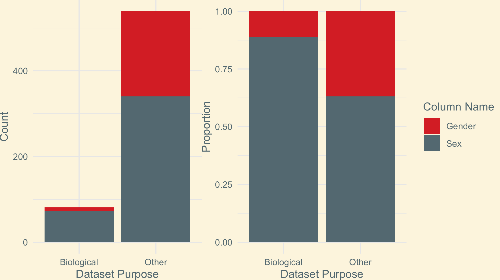

```{r setup, include = FALSE}
knitr::opts_chunk$set(fig.width = 13, 
                      message = FALSE, 
                      warning = FALSE)
```

class: title-slide, center, middle

# Social Categorizations in CRAN Data

Simon Couch, Reed '21 | `r fontawesome::fa('twitter', fill = '#fdf6e3')` `r fontawesome::fa('github', fill = '#fdf6e3')` `r fontawesome::fa('linkedin', fill = '#fdf6e3')` @simonpcouch

*ASA OR Winter Meeting, 10 March 2020*

<!-- --- -->

<!-- # Agenda  -->

<!-- ## I. The Problem with Data as "Raw" -->
<!-- ## II. Sex/Gender Effects in Research -->
<!-- ## III. Methods and Hypotheses -->
<!-- ## IV. Results -->
<!-- ## V. Looking Forward -->

---

layout: true

.footer[`r fontawesome::fa('twitter', fill = '#657b83')` `r fontawesome::fa('github', fill = '#657b83')` `r fontawesome::fa('linkedin', fill = '#657b83')` @simonpcouch]


---

# The Problem with Data as "Raw"

---

# The Problem with Data as "Raw"

```{r, eval = FALSE}
super_important_df <- super_important_df %>%
  mutate(gender = case_when(
    sex == "male" ~ "man",
    sex == "female" ~ "woman",
    TRUE ~ NA_character_
  ))
```

---

# Sex/Gender Effects in Research: A Timeline

+ Rubin (1975) - *"The sex/gender distinction analytically separates the anatomy and physiology of males and females (sex) from the behavioral and cultural expectations associated with the ideals of masculinity and femininity (gender)"*

---

# Sex/Gender Effects in Research: A Timeline

+ Rubin (1975) - *"The sex/gender distinction analytically separates the anatomy and physiology of males and females (sex) from the behavioral and cultural expectations associated with the ideals of masculinity and femininity (gender)"*


+ ...

---

# Sex/Gender Effects in Research: A Timeline

+ Rubin (1975) - *"The sex/gender distinction analytically separates the anatomy and physiology of males and females (sex) from the behavioral and cultural expectations associated with the ideals of masculinity and femininity (gender)"*


+ ...


+ Springer et al. (2012) - *“These definitions lend a superficial sense that sex and gender are distinct domains, even as they give causal and temporal priority to biology (‘gender is rooted in biology’ but sex is presumably pristine and emerges regardless of environment and experience.)”*

---

# Hypotheses

**1(a):** *Datasets from packages intended for biological purposes will be more likely to refer to sex/gender measures as sex rather than gender, if one or the other is included, than datasets from packages intended for other purposes.*


**2(a):** *The distribution of values in columns named* **Sex** *will not differ from that of columns named* **Gender**. *Namely, the frequencies of the entries* **Male**, **Female**, *and others (as a group) will not be different.*

---

# Methods

+ Infer the purpose of CRAN packages (Task Views, text matching on metadata)
+ Check for relevant columns in datasets housed in those packages (text matching)
+ Collect the unique entries in those columns

---

# Methods

+ **Infer** the **purpose** of CRAN packages (Task Views, text matching on metadata)
+ Check for **relevant** columns in datasets housed in those packages (text matching)
+ Collect the unique entries in those columns

---

# Methods

+ **Infer** the **purpose** of CRAN packages (Task Views, text matching on metadata)
+ Check for **relevant** columns in datasets housed in those packages (text matching)
+ Collect the unique entries in those columns

Read: things get **messy**


---

# Results


```{r out.width=750, echo = FALSE, fig.align='center'}

```

---

# Results


```{r out.width=750, echo = FALSE, fig.align='center'}

```

---

# Looking Forward

+ Springer et al. (2012) - Scholars ought to *“conceptualize sex/gender as a domain of complex phenomena that are simultaneously biological and social, rather than a domain in which the social and biological ‘overlap’”*

---

# Looking Forward

+ Springer et al. (2012) - Scholars ought to *“conceptualize sex/gender as a domain of complex phenomena that are simultaneously biological and social, rather than a domain in which the social and biological ‘overlap’”*


+ Harris (1993) - *"[W]hen handling the complex issue of group identity, we should look to purposes and effects, consequences and functions... what must be addressed is who is defining, how is the definition constructed, and why is the definition being propounded."*

---

layout: true

.footer[]

---

class: title-slide, center, middle

# Thank You!

Special thanks to Kjersten Whittington, Yaejoon Kwon, Kristin Bott, and Kelly McConville for their valuable insight throughout this project.

Source code, bibliography, full paper, and slides available on GitHub at: 
*github.com/simonpcouch/social_divisions_in_data*

`r fontawesome::fa('twitter', fill = '#fdf6e3')` `r fontawesome::fa('github', fill = '#fdf6e3')` `r fontawesome::fa('linkedin', fill = '#fdf6e3')` @simonpcouch

---

# Sources

Harris, Cheryl (1993). Whiteness as Property. *Harvard Law Review*, 106(8), 1707-1791. doi:10.2307/1341787

Rubin, Gayle (1975). The Traffic in Women: Notes on the "Political Economy" of Sex. *Toward an Anthropology of Women*, pp. 157--210.

Springer, Kristen, Stellman, Jeanne Mager, and Jordan-Young, Rebecca M (2012). Beyond a catalogue of differences: a theoretical frame and good practice guidelines for researching sex/gender in human health. *Social science & medicine*, 74(11):1817–1824, 2012.

